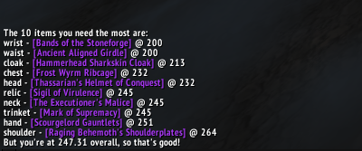

# What do I need?
A World of Warcraft addon that pulls the current characters items, sorts them, then visualizes the lowest items.

## Usage
To invoke the addon use the slash command `/wdin`.

## Example Output

